# Semantic Segmentation Baselines

Implementations of neural network papers for semantic segmentation using Keras
and TensorFlow.

<p align="center">
  Predictions from Tiramisu on CamVid video stream.
  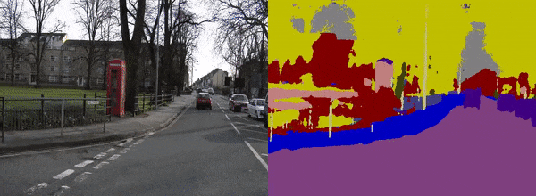
</p>

## Installation

To install requirements for the project:

```shell
python -m pip install -r requirements.txt
```

## Hardware Specification

Results were generated using a machine equipped with  128GB RAM, nVidia P100
GPU, and Intel Xeon CPU @ 2.10GHz. All results shown are from the testing
dataset.

## [CamVid][]

-   [32 classes][CamVid-classes] generalized to 11 classes using mapping in
    [11_class.txt](src/camvid/11_class.txt)
    -   use 12 labels and ignore the Void class (i.e., 11 labels)
-   960 x 720 scaled down by factor of 2 to 480 x 360

[CamVid]: http://mi.eng.cam.ac.uk/research/projects/VideoRec/CamVid/
[CamVid-classes]: http://mi.eng.cam.ac.uk/research/projects/VideoRec/CamVid/#ClassLabels

# Models

<details>
<summary>SegNet</summary>

## [SegNet][Badrinarayanan et al. 2015]

<table>
  <tr>
    <td>
        
    </td>
    <td>
        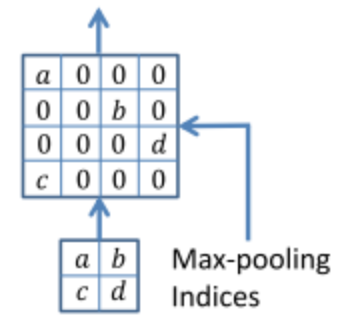
    </td>
  </tr>
</table>

The following table describes training hyperparameters.

| Crop Size | Epochs | Batch Size | Patience | Optimizer | α    | 𝛃    | α Decay |
|:----------|:-------|:-----------|:---------|:----------|:-----|:-----|:--------|
| 352 x 480 | 200    | 8          | 50       | SGD       | 1e-3 | 0.9  | 0.95    |

-   batch normalization statistics computed per batch during training and
    using a rolling average computed over input batches for validation and
    testing
    -   original paper uses a static statistics computed over the training data
-   encoder transfer learning from VGG16 trained on ImageNet
-   best model in terms of validation accuracy is kept as final model
-   median frequency balancing of class labels ([Eigen et al. 2014][])
    -   weighted categorical cross-entropy loss function
-   local contrast normalization of inputs ([Jarrett et al. 2009][])
-   pooling indexes ([Badrinarayanan et al. 2015][])

### Quantitative Results

The following table outlines the testing results from SegNet.

| Metric                  |    Value |
|:------------------------|---------:|
| Accuracy                | 0.888625 |
| Mean Per Class Accuracy | 0.722078 |
| Mean I/U                | 0.577455 |
| Bicyclist               | 0.435263 |
| Building                | 0.743735 |
| Car                     | 0.700505 |
| Column/Pole             | 0.254089 |
| Fence                   | 0.385431 |
| Pedestrian              | 0.393298 |
| Road                    | 0.895652 |
| Sidewalk                | 0.747693 |
| Sign                    | 0.219355 |
| Sky                     | 0.888208 |
| Vegetation              | 0.688779 |

### Qualitative Results

<table>
  <tr>
    <td>
      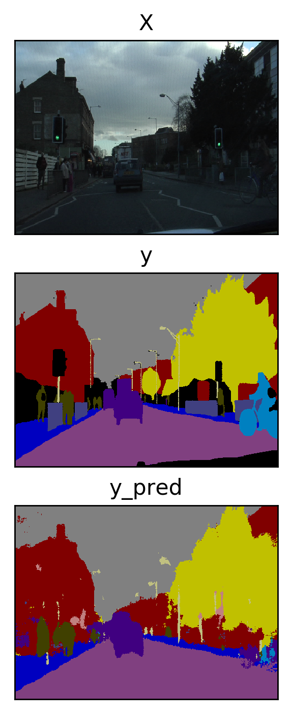
    </td>
    <td>
      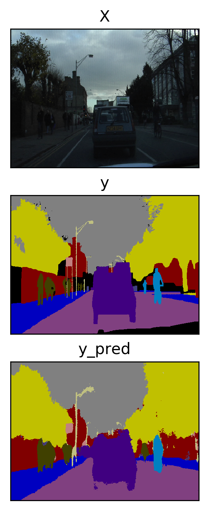
    </td>
    <td>
      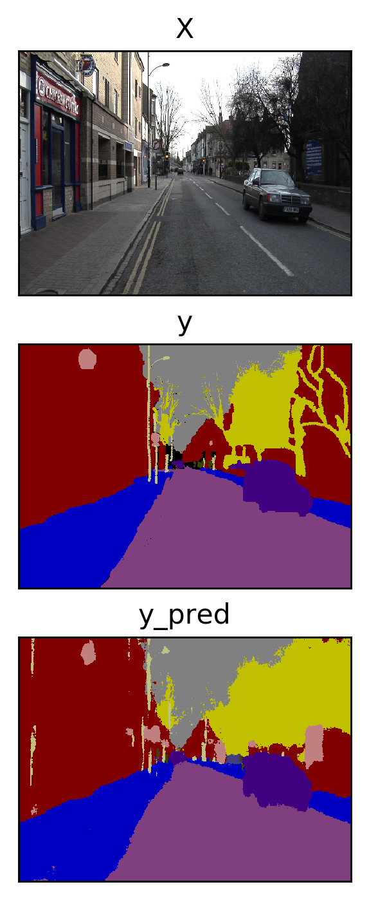
    </td>
    <td>
      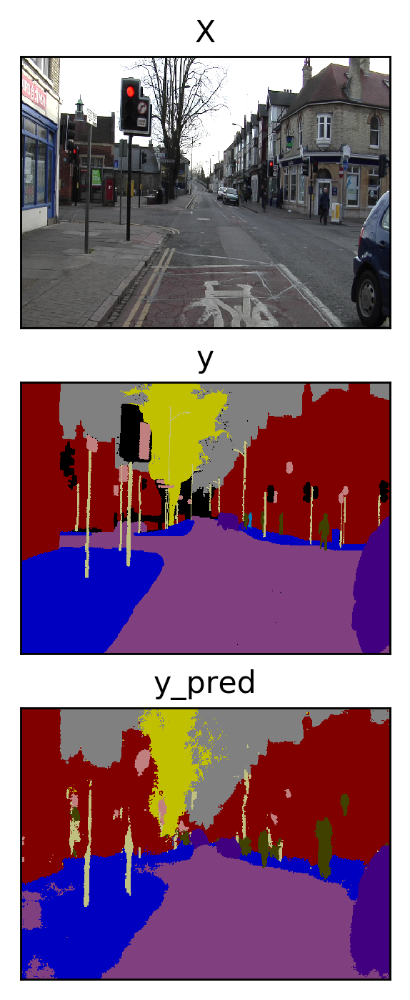
    </td>
  </tr>
</table>

</details>


<details>
<summary>Bayesian SegNet</summary>

## [Bayesian SegNet][Kendall et al. 2015]

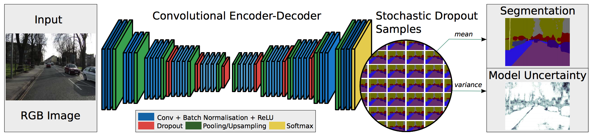

The following table describes training hyperparameters.

| Crop Size | Epochs | Batch Size | Patience | Optimizer | α    | 𝛃    | α Decay | Dropout | Samples |
|:----------|:-------|:-----------|:---------|:----------|:-----|:-----|:--------|:--------|:--------|
| 352 x 480 | 200    | 8          | 50       | SGD       | 1e-3 | 0.9  | 0.95    | 50%     | 40      |

-   batch normalization statistics computed per batch during training and
    using a rolling average computed over input batches for validation and
    testing
    -   original paper uses a static statistics computed over the training data
-   encoder transfer learning from VGG16 trained on ImageNet
    -   note that VGG16 does not have any dropout by default; transfer from a
        Bayesian VGG16 model could improve results
-   best model in terms of validation accuracy is kept as final model
-   median frequency balancing of class labels ([Eigen et al. 2014][])
    -   weighted categorical cross-entropy loss function
-   local contrast normalization of inputs ([Jarrett et al. 2009][])
-   pooling indexes ([Badrinarayanan et al. 2015][])

### Quantitative Results

The following table outlines the testing results from Bayesian SegNet.

| Metric                  |    Value |
|:------------------------|---------:|
| Accuracy                | 0.863547 |
| Mean Per Class Accuracy | 0.769486 |
| Mean I/U                | 0.547227 |
| Bicyclist               | 0.407042 |
| Building                | 0.68995  |
| Car                     | 0.678854 |
| Column/Pole             | 0.206012 |
| Fence                   | 0.376584 |
| Pedestrian              | 0.305958 |
| Road                    | 0.88796  |
| Sidewalk                | 0.727901 |
| Sign                    | 0.155895 |
| Sky                     | 0.888182 |
| Vegetation              | 0.69516  |

### Qualitative Results

<table>
  <tr>
    <td>
      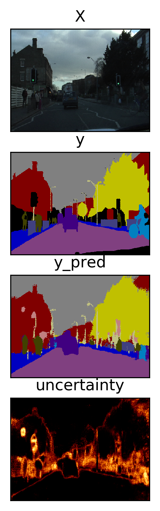
    </td>
    <td>
      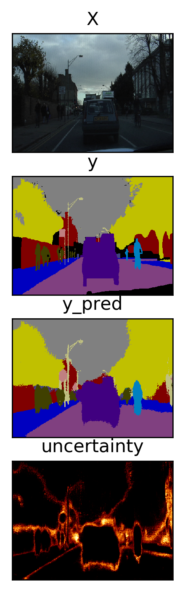
    </td>
    <td>
      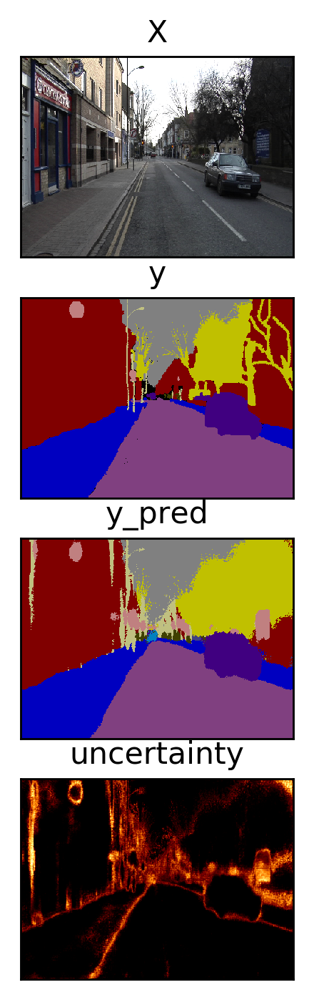
    </td>
    <td>
      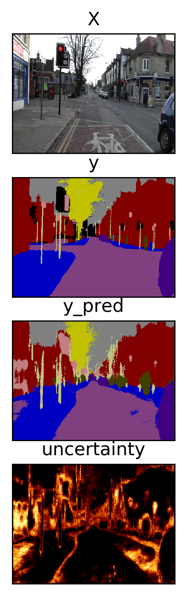
    </td>
  </tr>
</table>

</details>


<details>
<summary>The One Hundred Layers Tiramisu</summary>

## [The One Hundred Layers Tiramisu][Jégou et al. 2016]

<table>
  <tr>
    <td>
        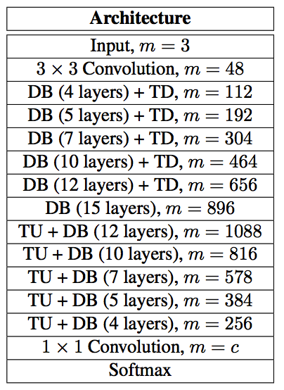
    </td>
    <td>
        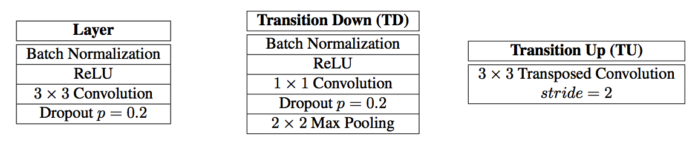
    </td>
  </tr>
</table>

The following table describes training hyperparameters.

| Crop Size | Epochs | Batch Size | Patience | Optimizer | α    | α Decay | Dropout |
|:----------|:-------|:-----------|:---------|:----------|:-----|:--------|:--------|
| 224 x 224 | 200    | 3          | 100      | RMSprop   | 1e-3 | 0.995   | 20%     |
| 352 x 480 | 200    | 1          | 50       | RMSprop   | 1e-4 | 1.000   | 20%     |

-   random _horizontal_ flips of images during training
    -   the paper says vertical, but their implementation clearly shows
        horizontal flips (likely a typo). Horizontal make more sense than
        vertical anyway and produces empirically better test results
-   batch normalization statistics computed _per batch_ during training,
    validation, and testing
-   skip connections between encoder and decoder ([Jégou et al. 2016][])

### Quantitative Results

The following table outlines the testing results from 103 Layers Tiramisu.

| Metric                  |    Value |
|:------------------------|---------:|
| Accuracy                | 0.908092 |
| Mean Per Class Accuracy | 0.716523 |
| Mean I/U                | 0.585788 |
| Bicyclist               | 0.34839  |
| Building                | 0.775576 |
| Car                     | 0.689861 |
| Column/Pole             | 0.312897 |
| Fence                   | 0.261254 |
| Pedestrian              | 0.4299   |
| Road                    | 0.918804 |
| Sidewalk                | 0.802591 |
| Sign                    | 0.253895 |
| Sky                     | 0.91806  |
| Vegetation              | 0.732444 |

### Qualitative Results

<table>
  <tr>
    <td>
      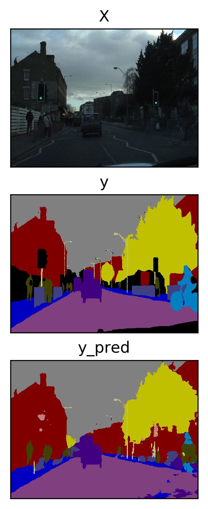
    </td>
    <td>
      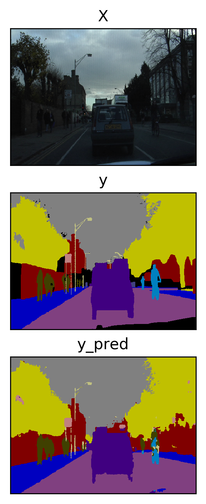
    </td>
    <td>
      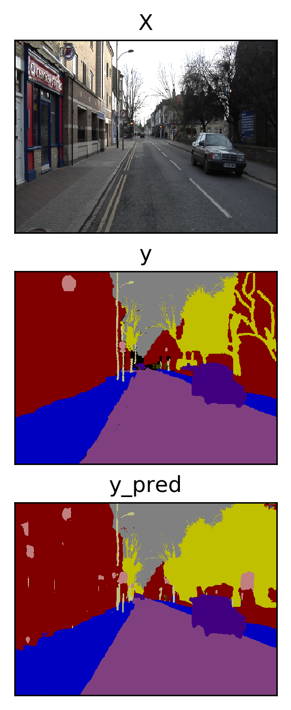
    </td>
    <td>
      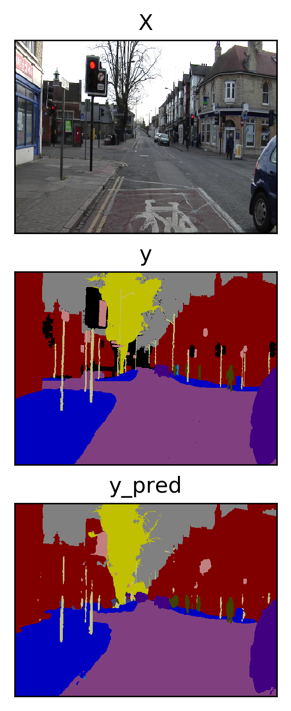
    </td>
  </tr>
</table>

</details>


<details>
<summary>Bayesian The One Hundred Layers Tiramisu</summary>

## [Bayesian Tiramisu][Kendall et al. 2017]

### Aleatoric Uncertainty

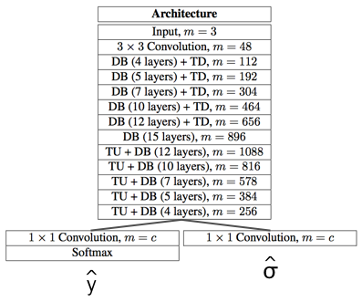

The following table describes training hyperparameters.

| Crop Size | Epochs | Batch Size | Patience | Optimizer | α    | α Decay | Dropout |
|:----------|:-------|:-----------|:---------|:----------|:-----|:--------|:--------|
| 352 x 480 | 100    | 1          | 10       | RMSprop   | 1e-4 | 1.000   | 20%     |

-   network split to predict targets and loss attenuation
    -   custom loss function to train the second head of the network
        ([Kendall et al. 2017][])
    -   our loss function samples _through the Softmax function_ like their
        paper says (but contrary to the mathematics they present?). without
        applying the Softmax function, the loss is unstable and goes negative
-   pre-trained with fine weights from original Tiramisu
-   pre-trained network frozen while head to predict sigma is trained

#### Quantitative Results

The quantitative results are the same as the standard Tiramisu model.

#### Qualitative Results

<table>
  <tr>
    <td>
      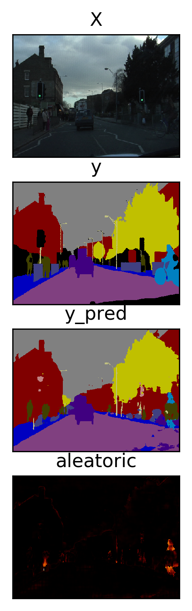
    </td>
    <td>
      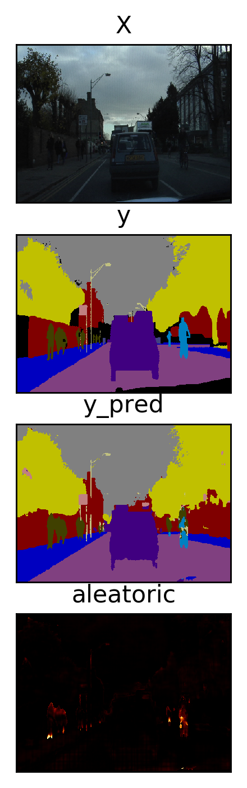
    </td>
    <td>
      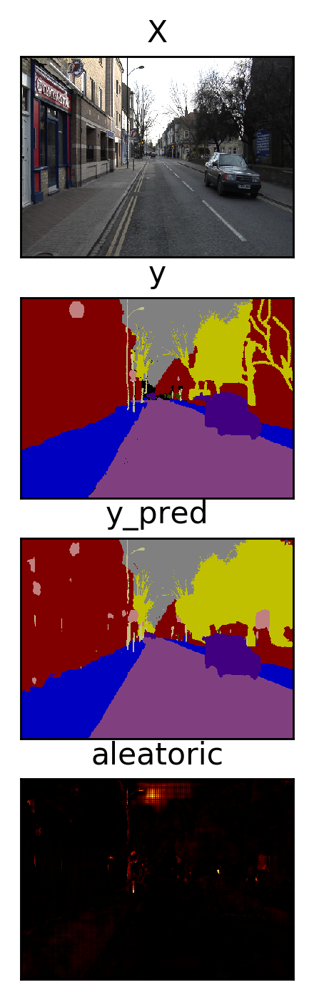
    </td>
    <td>
      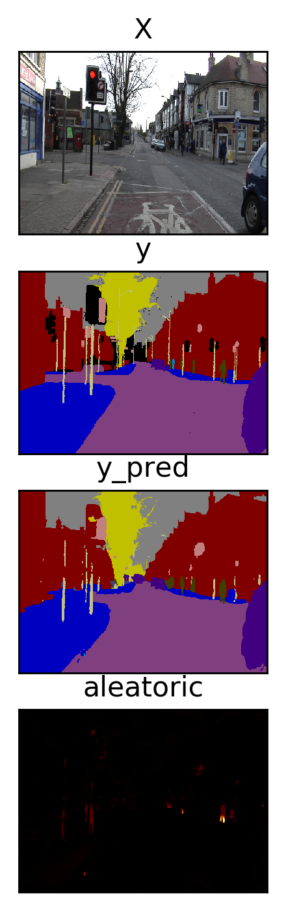
    </td>
  </tr>
</table>

### Epistemic Uncertainty

-   pre-trained with fine weights from original Tiramisu
-   50 samples for Monte Carlo Dropout sampling at test time

#### Quantitative Results

The following table outlines the testing results from Epistemic Tiramisu.

| Metric                  |    Value |
|:------------------------|---------:|
| Accuracy                | 0.881144 |
| Mean Per Class Accuracy | 0.59509  |
| Mean I/U                | 0.506473 |
| Bicyclist               | 0.280771 |
| Building                | 0.734256 |
| Car                     | 0.587708 |
| Column/Pole             | 0.124245 |
| Fence                   | 0.164669 |
| Pedestrian              | 0.322883 |
| Road                    | 0.886696 |
| Sidewalk                | 0.724571 |
| Sign                    | 0.165528 |
| Sky                     | 0.88297  |
| Vegetation              | 0.696909 |

#### Qualitative Results

<table>
  <tr>
    <td>
      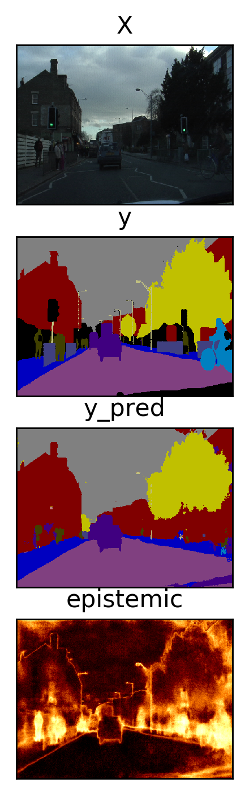
    </td>
    <td>
      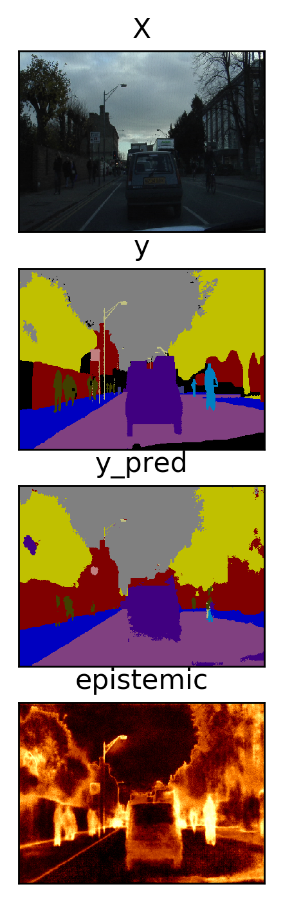
    </td>
    <td>
      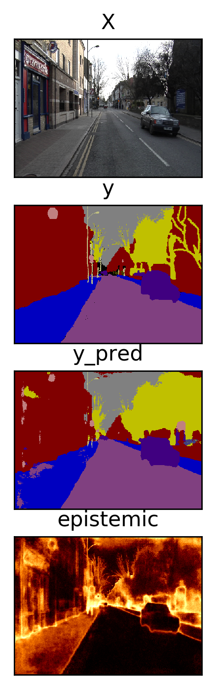
    </td>
    <td>
      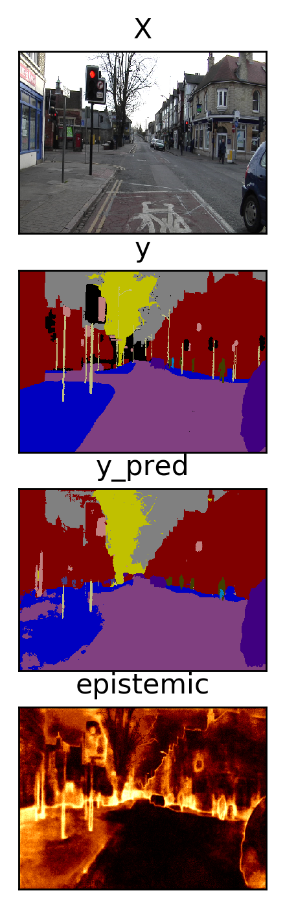
    </td>
  </tr>
</table>

</details>


<details>
<summary>Wall Clock Inference Time Metrics</summary>

## Wall Clock Inference Time Metrics

The following box plot describes the mean and standard deviation in wall clock
time execution of different segmentation models performing inference on images
of size 352 x 480 pixels.

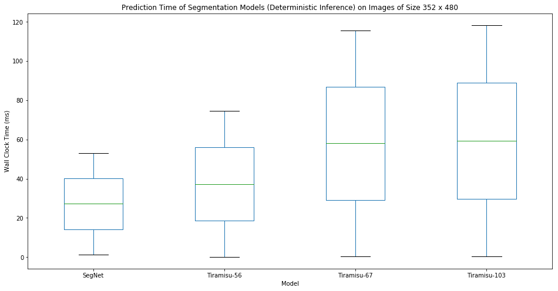

The following box plot describes the mean and standard deviation in wall clock
time execution of different Bayesian segmentation models performing inference
on images of size 352 x 480 pixels. Note that in this case, inference is
probabilistic due to the test time dropout and Monte Carlo simulation over 50
network samples.

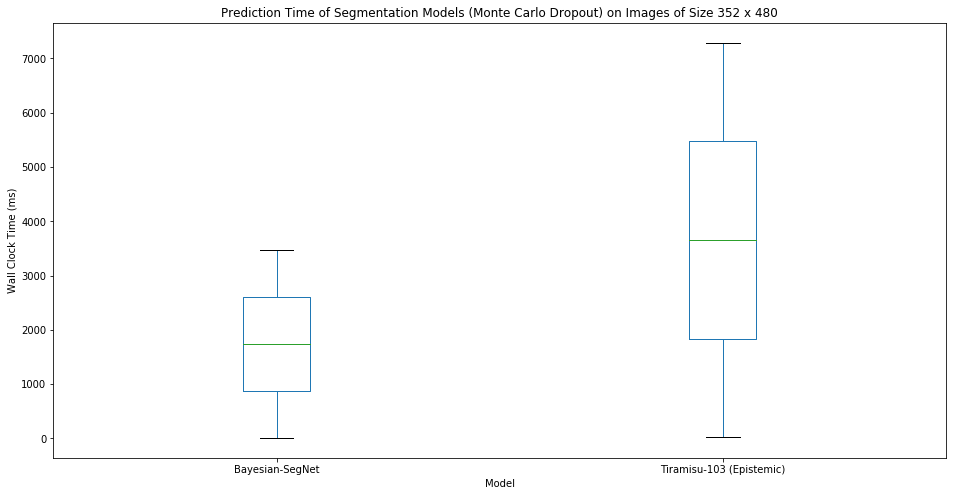

</details>


# References

[Badrinarayanan V, Kendall A, Cipolla R (2015) SegNet: A Deep Convolutional Encoder-Decoder Architec- ture for Image Segmentation. ArXiv e-prints.][Badrinarayanan et al. 2015]

[Eigen D, Fergus R (2014) Predicting Depth, Surface Normals and Semantic Labels with a Common Multi- Scale Convolutional Architecture. ArXiv e-prints.][Eigen et al. 2014]

[Jarrett K, Kavukcuoglu K, Ranzato M, LeCun Y (2009) What is the best multi-stage architecture for object recognition? 2009 IEEE 12th International Conference on Computer Vision, 2146–2153.][Jarrett et al. 2009]

[Jégou S, Drozdzal M, Vazquez D, Romero A, Bengio Y (2016) The One Hundred Layers Tiramisu: Fully Convolutional DenseNets for Semantic Segmentation. ArXiv e-prints.][Jégou et al. 2016]

[Kendall A, Badrinarayanan V, Cipolla R (2015) Bayesian SegNet: Model Uncertainty in Deep Convolutional Encoder-Decoder Architectures for Scene Understanding. ArXiv e-prints.][Kendall et al. 2015]

[Kendall A, Gal Y (2017) What Uncertainties Do We Need in Bayesian Deep Learning for Computer Vision? ArXiv e-prints.][Kendall et al. 2017]

[Badrinarayanan et al. 2015]: https://arxiv.org/abs/1511.00561
[Eigen et al. 2014]: https://arxiv.org/abs/1411.4734
[Jarrett et al. 2009]: https://ieeexplore.ieee.org/document/5459469
[Jégou et al. 2016]: https://arxiv.org/abs/1611.09326
[Kendall et al. 2015]: https://arxiv.org/abs/1511.02680
[Kendall et al. 2017]: https://arxiv.org/abs/1703.04977
